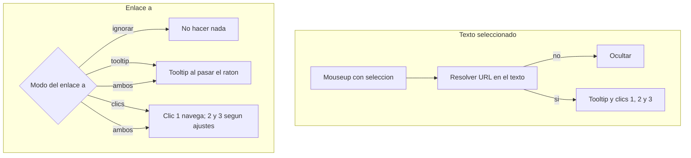

# Extensión Better Links

Proyecto vacío: se crea la extensión desde cero, sin bundler ni dependencias. Vanilla JS, Manifest V3.

## Dos formas de tratar un enlace

### Texto seleccionado (no es un `<a>`)

Al soltar el ratón con una selección válida, si el tooltip está activo se muestra encima de la selección (debajo si no cabe). Los clics posteriores sobre ese texto se cuentan en una ventana de ~450 ms:

- 1 clic: abrir en una ventana nueva (por defecto)
- 2 clics: abrir en una pestaña nueva (por defecto)
- 3 clics: copiar la URL resuelta (por defecto)

El gesto de seleccionar no cuenta. Ese clic se captura en fase capture para no colapsar la selección. Escape o un clic fuera ocultan el tooltip. Los botones del tooltip ejecutan la acción al momento. Si "mostrar tooltip" está desactivado, los clics sobre el texto siguen funcionando.

En `input` / `textarea` solo se muestra el tooltip (los clics de 1/2/3 romperían el cursor).

No se exige seleccionar el contenido de un `<a>`: puede ser una imagen o un bloque HTML.

### Enlaces `<a>` al clicar, sin seleccionar

Se actúa sobre el `<a>` (aunque el contenido sea una imagen u otro HTML). Un ajuste elige el modo:

- Ignorar
- Mostrar tooltip
- Aplicar clics
- Mostrar tooltip y aplicar clics

Por defecto: mostrar tooltip y aplicar clics.

El clic simple no se reconfigura: sigue abriendo el enlace en la misma pestaña. Solo cuando el modo incluye "aplicar clics" se retrasa ese primer clic unos 450 ms para poder distinguir el doble y el triple; si no llega otro clic, se deja la navegación normal.

- 2 clics: pestaña nueva (por defecto). Opciones: ventana nueva, pestaña nueva o copiar
- 3 clics: copiar (por defecto). Las mismas tres opciones

Esas dos listas solo se pueden cambiar si el modo incluye "aplicar clics". Si el modo es Ignorar o solo Mostrar tooltip, quedan deshabilitadas.

El tooltip (modos que lo incluyen) aparece al pasar el ratón por el `<a>`, sin seleccionar nada. Sus botones: ventana nueva, pestaña nueva y copiar. Con "aplicar clics" se evita que el 2.º y el 3.er clic naveguen o seleccionen el contenido.

## Qué cuenta como enlace

Texto seleccionado (se ignora si la selección cae dentro de un `<a>`):

1. URL con protocolo http(s), tal cual.
2. Dominio sin protocolo (`ejemplo.com`, `www.ejemplo.com/ruta`, puerto y query). Se abre como `https://...`. Hace falta un punto y un TLD.
3. Con "intentar corregir enlaces" activo, se reparan fallos de protocolo antes de validar: `https//sdf` → `https://sdf`, `http:/fds` → `http://fds`, `https:/ejemplo.com` → `https://ejemplo.com`, `htps://` / `htp://`, y barras de más (`https:///...`). Con protocolo, un host sin punto como `sdf` sí vale. Sin protocolo, no.

En un `<a>`, la URL es `a.href` si ya es http(s). Si el atributo `href` está roto y la corrección está activa, se repara ese atributo. No hace falta seleccionar el contenido.

Copiar y abrir usan siempre la URL ya resuelta. Solo se abren URLs `http` y `https`.

## Configuración

Página de opciones ([options/options.html](options/options.html)), abierta al pulsar el icono de la barra. Preferencias en `chrome.storage.sync`:

Texto seleccionado:

- Mostrar tooltip (por defecto: sí)
- Acción de 1, 2 y 3 clics: ventana nueva, pestaña nueva, copiar o ninguna

Enlaces `<a>`:

- Modo: ignorar, mostrar tooltip, aplicar clics, o mostrar tooltip y aplicar clics (por defecto: las dos últimas juntas)
- Acción de 2 clics: ventana nueva, pestaña nueva o copiar (por defecto: pestaña nueva)
- Acción de 3 clics: las mismas tres opciones (por defecto: copiar)
- Esas dos acciones se deshabilitan en el formulario si el modo no incluye "aplicar clics"

General:

- Intentar corregir enlaces (por defecto: sí), con los ejemplos `https//sdf` y `http:/fds`
- Idioma: Automático (idioma del navegador; si no es español, inglés), Español o English

Los cambios se aplican al guardar y las pestañas ya abiertas los leen en el siguiente uso (el content script escucha `storage.onChanged`).

## Idiomas

- [_locales/es/messages.json](_locales/es/messages.json) y [_locales/en/messages.json](_locales/en/messages.json) solo para el nombre y la descripción de la extensión en `chrome://extensions`.
- [shared/i18n.js](shared/i18n.js) con los textos de tooltip y opciones, porque `chrome.i18n` no permite cambiar el idioma en caliente. Nombre visible: "Better Links" en ambos.

## Archivos

- [manifest.json](manifest.json): MV3, `default_locale` `en`, content scripts en `<all_urls>` y todos los frames, `permissions: ["storage"]`. El service worker abre pestañas y ventanas; no hace falta permiso `tabs` para crearlas. Copiar se hace en el content script con el gesto del usuario (`navigator.clipboard`, respaldo con `execCommand`).
- [shared/defaults.js](shared/defaults.js), [shared/link.js](shared/link.js), [shared/i18n.js](shared/i18n.js): valores por defecto, detección/reparación y textos. Scripts clásicos en un namespace `BetterLinks` para poder cargarlos en el content script sin bundler.
- [content/content.js](content/content.js) y [content/content.css](content/content.css): selección de texto plano, clics y hover sobre `<a>` según el modo, tooltip en Shadow DOM, aviso breve de "Copiado".
- [background.js](background.js): `chrome.tabs.create` / `chrome.windows.create` tras validar `http(s)`, y `chrome.action.onClicked` → página de opciones.
- [options/options.html](options/options.html), [options/options.css](options/options.css), [options/options.js](options/options.js): formulario accesible, etiquetas según el idioma elegido.
- Iconos PNG 16, 48 y 128 (eslabón simple) para la barra y `chrome://extensions`.
- [shared/link.test.js](shared/link.test.js): pruebas de Node (`node --test`) para reparación, dominios y rechazos (texto normal, `javascript:`). La selección dentro de un `<a>` no se trata como texto seleccionado.

## Verificación

Las pruebas automáticas cubren la lógica de enlaces. La UI de la extensión no se puede ejercitar en el navegador integrado de Cursor: al terminar se indicará cargarla en `chrome://extensions` (modo desarrollador, carpeta del proyecto) y probar la selección de texto, el tooltip y los clics 2/3 sobre un `<a>` (imagen o bloque), que las acciones de 2 y 3 clics se deshabilitan si el modo no aplica clics, la corrección de URLs y el cambio de idioma.